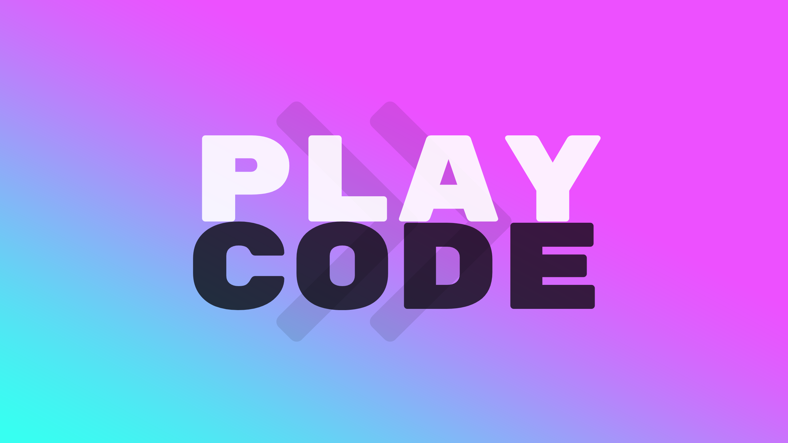

<div align="center">

<a href="https://github.com/mxsjoberg/playcode" alt="PlayCode">
    
</a>

<h1 style="border-bottom: none">
    <b>PlayCode</b>
    <br>
    A Playful Programming Language
    <br>
</h1>

</div>

PlayCode is procedural because knowing-how is more important than knowing-that, i.e. [street smarts](https://en.wikipedia.org/wiki/Procedural_knowledge). It will most likely be dynamically typed because no one have time for types anyway? There will be numbers, maybe strings, probably arrays, if-statements, while-loops, variables, and comments.

Currently experimenting with the following features:

- **Tags** `@<tag>` followed by some statement to define and tag `@<tag>` followed by nothing to call, so that basically every line can be called from anywhere in the program and return itself once. It's like a macro or lightweight function.

- **Swaps** `swap <a> <b>` to swap the values of two variables, which is useful for example when sorting. What else could be swapped? AST branch?

- **Inline asserts** `x -> "2"` to assert that `x` is equal to `"2"`. This is useful for testing and debugging. 


Below are examples of valid programs.

```
print 42
```

```
x = 2

if x > 0 {
    print True
} else {
    print False
}
```

```
-- swap
x = 2 * 2
y = 2

swap x y

print 1 + (x * y) - (6 / x) -> "6"
```

```
-- tags
x = 0

@inc x = x + 1
@inc

print x -> "1"
```

```
-- this is a comment
```

```
-- this is an assert without output
x -> "2"
```

```
-- and this is assert with output
print x -> "2"
```

## Current status

Working to replace handwritten lexer and parser with [Lark](https://github.com/lark-parser/lark).

### Working example: bubble sort

```
-- bubble sort
x = [5, 3, 8, 4, 2]
n = 5
i = 0
@init_j j = 0
while i < (n - 1) {
    @init_j
    while j < (n - 1) {
        if x[j] > x[j + 1] {
            swap x[j] x[j + 1]
        }
        j = j + 1
    }
    i = i + 1
}
x -> "[2, 3, 4, 5, 8]"
```

Running `python3 pc.py tests/test_bubblesort.pc --tables`.

```
SYMBOL_TABLE: {'x': [2, 3, 4, 5, 8], 'n': 5, 'i': 4, 'j': 4}
TAG_TABLE: {'@init_j': Tree(Token('RULE', 'assign_stmt'), [Tree(Token('RULE', 'identifier'), [Token('CNAME', 'j')]), Tree(Token('RULE', 'expr'), [Tree(Token('RULE', 'term'), [Tree('number', [Token('SIGNED_NUMBER', '0')])])])])}
```

### Inline asserts example

```
-- bubble sort
x = [5, 3, 8, 4, 2]
n = 5
i = 0
@init_j j = 0
while i < (n - 1) {
    @init_j
    while j < (n - 1) {
        if x[j] > x[j + 1] {
            swap x[j] x[j + 1]
        }
        j = j + 1
    }
    i = i + 1
}

-- bad change
x[2] = 1

x -> "[2, 3, 4, 5, 8]"
```

Running `python3 pc.py --tests`.

```
Running tests
  tests/test_while.pc OK
  tests/test_tags.pc OK
  tests/test_bubblesort.pc Failed
    1 - Assert error: [2, 3, 1, 5, 8] not equal to [2, 3, 4, 5, 8]
  tests/test_swap.pc OK
  tests/test_if.pc OK
Done
```

### TODOs

Using [todoparser.sh](https://github.com/mxsjoberg/todoparser).


