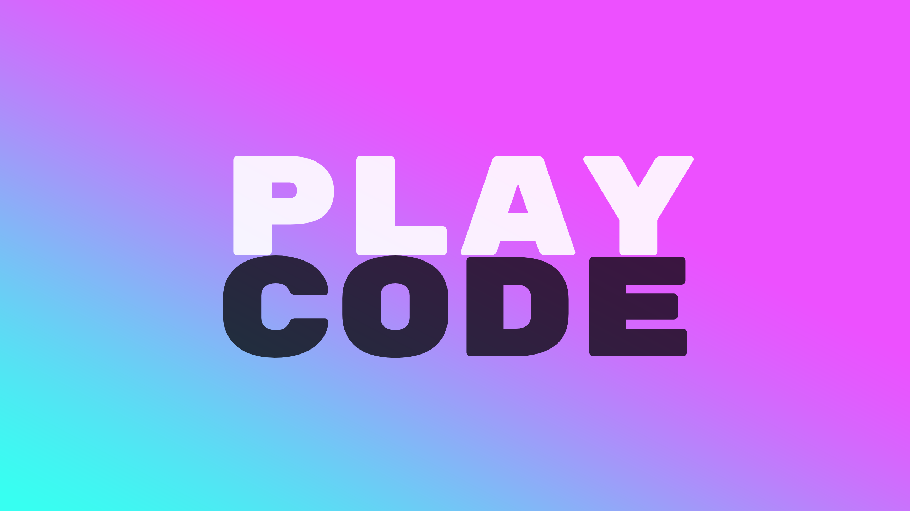

# PlayCode: A Playful Programming Language

PlayCode is procedural because knowing-how is more important than knowing-that, i.e. [street smarts](https://en.wikipedia.org/wiki/Procedural_knowledge). It will most likely be dynamically typed because no one have time for types anyway. There will be numbers, strings, lists, if-statements, for-loops, variables, and comments. There will probably also be a lot of things that are not yet decided.

Additionally, and more importantly, there will be two main features that will make PlayCode exciting:

- Tags `@<tag>` and goto tag `goto @<tag>` to enable any statement to become a function, so that basically every line can be called from anywhere in the program and return itself once. Imagine playing an instrument where each key or string can be played at any moment and always return some sound.

- Swaps `swap <a> <b>` to swap the values of two variables, which is useful for example when sorting.

Below are examples of valid programs.

```
print 42
```

```
x = 42
-- comment
if x < 0 {
    print false
} else {
    print "positive"
}
```

Brackets `{` and `}` define a block and variables defined inside are only available locally inside the block.

```
-- swap
x = 2
y = 3
swap x y
print y == 2 -> true
```

```
-- tags
x = 0
@inc x++
goto @inc
print x -> 2
```

There are two ways to include comments, `--` and `->`, which also can be used as helpers in source for more readable code.

There are only integers, no such thing as floats or "real" numbers (jk, might add later, but not important right now).

## Current status

Assignments, swaps, print, and expressions working.

```
x = 2 * 2
y = 2
-- swap
swap x y
-- print
print 1 + (x * y) - (6 / x) -> 6
```

AST:

```
Token(TokenType.ASSIGN)
    Token(TokenType.IDENTIFIER, 'x')
        Token(TokenType.MULTIPLY, '*')
            Token(TokenType.INTEGER, '2')
            Token(TokenType.INTEGER, '2')
Token(TokenType.ASSIGN)
    Token(TokenType.IDENTIFIER, 'y')
    Token(TokenType.INTEGER, '2')
Token(TokenType.KEYWORD, 'SWAP')
    Token(TokenType.IDENTIFIER, 'x')
    Token(TokenType.IDENTIFIER, 'y')
Token(TokenType.KEYWORD, 'PRINT')
    Token(TokenType.MINUS, '-')
            Token(TokenType.PLUS, '+')
                Token(TokenType.INTEGER, '1')
                    Token(TokenType.MULTIPLY, '*')
                        Token(TokenType.IDENTIFIER, 'x')
                        Token(TokenType.IDENTIFIER, 'y')
            Token(TokenType.DIVIDE, '/')
                Token(TokenType.INTEGER, '6')
                Token(TokenType.IDENTIFIER, 'x')
```

Symbol table:

```
{'x': Token(TokenType.INTEGER, '2'), 'y': [Token(TokenType.MULTIPLY, '*'), [Token(TokenType.INTEGER, '2'), Token(TokenType.INTEGER, '2')]]}
```

